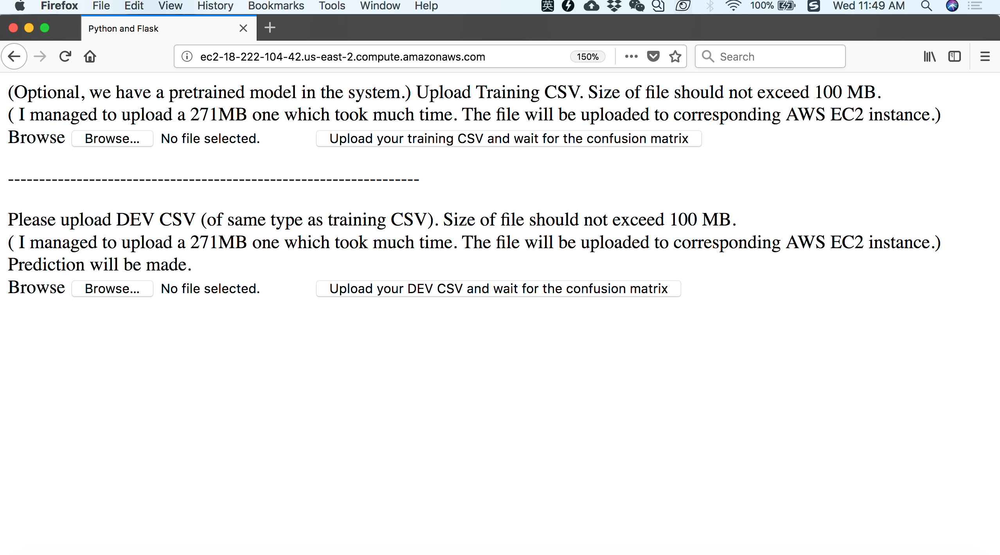
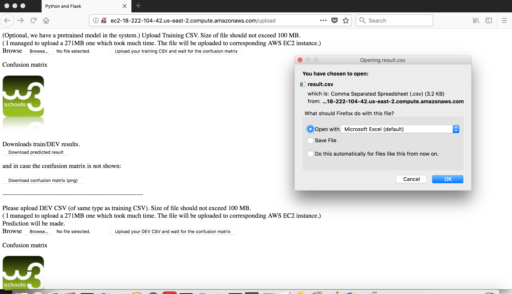
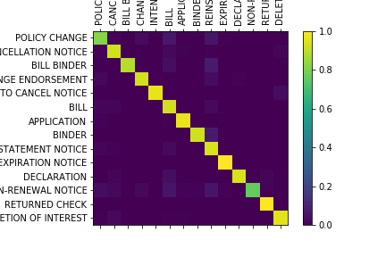
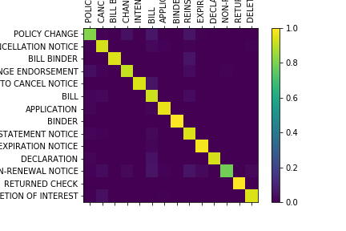

# Document classification: a quick start
### Webservice with training and DEV/TEST CSV uploads

I deployed on AWS EC2 (Ubuntu) a webservice with training and DEV/TEST CSV uploads[^fn1]. It initially appears


and after uploading DEV/TEST CSV file:


where two confusion matrices should be displayed as (and eventually I failed to display the two due to html's issue of locating images) : 
<p>  
</p> 

```diff
- with overall accuracy ~ 93.8% and  original codes 
```
[trainNB.ipynb](README_resources/NaivBayes_trigram/trainNB.ipynb) and [loadNB.ipynb](README_resources/NaivBayes_trigram/loadNB.ipynb).


# Tutorial: for user and for developer
### For user: how to use webservice
1. In a friendly browser, enter [^fn1].
2. Since we have pretrained model in the instance, a user can just ignore two buttons in the first block and upload DEV/TEST CSV (of same format as the original training CSV) by two buttons in the second block of htmls (first block and second block are separated by ------------------------).
3. Once the confusion matrices are shown (since I have problem locating local image files by html, they are presented by two same W3schools' image(s) from an online source), you are use newly appeared (four) buttons to download predicted labels and  image for confusion matrix of training CSV and DEV/TEST CSV.
4. (Optional) If one want to change training CSV (the default pretrained model uses entire original CSV) so as to overwrite the pretained/ previous model, use first block's two buttons. Notice the training CSV needs to be big enough to include all labels/ targets -- in my testcases, at least we should have `row160.csv`.
```diff
- If you need to get back to the pretrained model,
- (pretrained by the entire dataset, the classifier is ~44MB, reasonably small)
- notice there is a third button in first block called **Back to original model**.
```

### For developer: initial setup for deployment on AWS EC2 (Ubuntu)

1. Establish a AWS EC2 (Ubuntu Server 16.04 LTS (HVM), SSD Volume Type) instance following [^fn2] where the only difference is to choose 't2.small' for enough CPU memory (2GiB). Remember to set inbound rules [^fn2]. Denote IPv4 address of the instance by [EC2-IPv4].
2. Before ssh, it is convenient to edit the ~/.ssh/config (local machine) by adding [^fn2]
<figure class="highlight"><pre><code class="language-bash" data-lang="bash"><div class="shell"><pre><span></span>Host aws
    HostName <span class="m">[EC2-IPv4]</span>
    User ubuntu
    Port <span class="m">22</span>
    IdentityFile ~/.ssh/aws.pem</code></pre></figure>


3. Run `ssh aws` to log in and `git clone https://github.com/yezhengli-Mr9/doc-class`.
4. We use python27 and need several packages: together with `nginx`, `uwsgi` [^fn2], we run
```
sudo apt-get update
sudo apt-get install python-pip
sudo apt-get install nginx
sudo apt-get install python-tk
sudo apt-get install uwsgi-core uwsgi-plugin-python
pip install --upgrade pip
pip install matplotlib sklearn scipy flask
```
5. In the root (of your EC2 instance), run `sudo cp nginx.conf /etc/nginx/nginx.conf` where `nginx.conf` is updated according to [^tn2, ^tn3]. After this, in order to clean up possible `uwsgi` taking the address localhost:5000 (of the EC2 instance) and restart `nginx`, run 
```
uwsgi --stop ~/doc_class/doc_class.pid
sudo killall -9 uwsgi
sudo /etc/init.d/nginx restart
uwsgi ~/doc_class/uwsgi.ini
```
6. Finally, in a friendly browser, enter [^tn1].

7. For debug, debug the system locally before publishing it by AWS.


### Measurement Criteria

**1. Does your webservice work?** Yes.

**2. Is your hosted model as accurate as ours? Better? (think confusion matrix)** The NB model embedded in my webservice refers to ones in[^fn4] but with trigrams and only focus on most frequent (70, 100 or 300) words:
 

```diff
- with overall accuracy ~ 93.8% and original codes
```
[trainNB.ipynb](README_resources/NaivBayes_trigram/trainNB.ipynb) and [loadNB.ipynb](README_resources/NaivBayes_trigram/loadNB.ipynb).

**3. Your code, is it understandable, readable and/or deployable?** 

**4. Do you use industry best practices in training/testing/deploying?** No since I do not know the best practices.

**5. Do you use modern packages/tools in your code and deployment pipeline like [this](https://stelligent.com/2016/02/08/aws-lambda-functions-aws-codepipeline-cloudformation/)?** I use EC2.
**6. The effectiveness of your demo, did you frame the problem and your approach to a solution, did you explain your thinking and any remaining gaps, etc?** 
```diff
- File loading is time-consuming. 
+ Much effort is spent on embedding my that much better but much slower model -- this should be one of the remaining gaps. 
- Since I managed to make the classifier as small as ~20-44MB while keeping overall accuracy >90%, the original issue is solved.
```


**7. Are we able to run your testcases against your webservice? Can we run them against our webservice?** Yes. My test cases are in [doc_class/uploads/](doc_class/uploads/) where for example, `row160.csv` includes leading 160 lines of original csv. Upload specification appears in htmls of my webservice, notice
- the larger the size, the longer the time to upload (although a 273MB file is uploadable).
- upload of training CSV is not necessary. If uploaded. CSV file should be big enough to have all labels/ targets appeared: in my test case, at least we have to have `row160.csv`. No corresponding requirements for DEV/TEST CSV, that is, `row10.csv`, `row20.csv`, etc. are fine to be DEV/TEST CSVs.


### References

[^fn1] Li, Yezheng, Mar. 12th-14th, 2018, Webservice with training, development CSV uploads, [http://ec2-??-??-??-??.us-east-2.compute.amazonaws.com/](http://ec2-18-216-141-107.us-east-2.compute.amazonaws.com)
```diff
- corresponding to [EC2-IPv4]. I have already established one with [EC2-IPv4] =18.216.141.107 
- with corresponding public DNS http://ec2-18-216-141-107.us-east-2.compute.amazonaws.com
- however, as I mentioned in step 1 of **tutorial for developer**, it is not a free tier, please 
- inform me when you finish reviewing my code and I will stop the current running instance (which later on will change its [EC2-IPv4]). 
- Public DNS be made non-dynamic -- just take time and I think it not quite important.  
```

[^fn2] Thompson, Ben, Mar 2015, Setting Up Flask on AWS, http://bathompso.com/blog/Flask-AWS-Setup/

[^fn3] Long, Pete, July 2017, Nginx Error – 413 Request Entity Too Large, https://www.petenetlive.com/KB/Article/0001325

[^fn4] Shaikh, Javed, July 2017, Machine Learning, NLP: Text Classification using scikit-learn, python and NLTK, https://towardsdatascience.com/machine-learning-nlp-text-classification-using-scikit-learn-python-and-nltk-c52b92a7c73a
