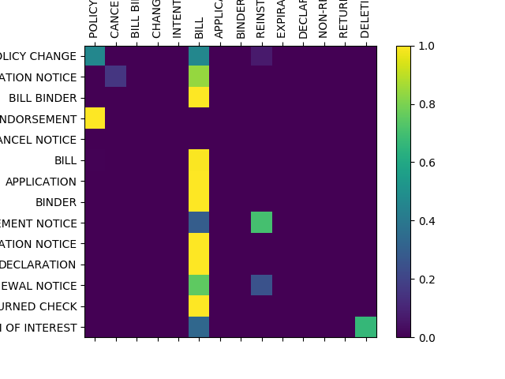
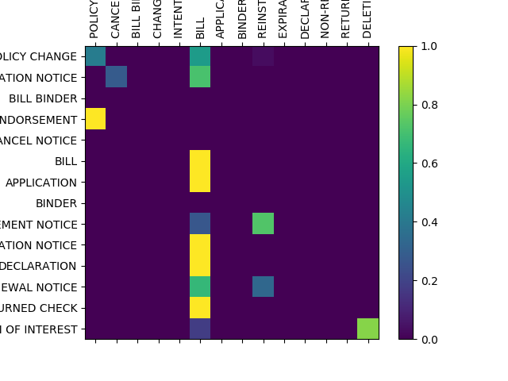
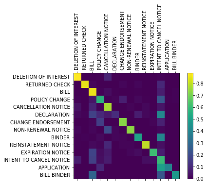

# doc-class
### Webservice with training, development CSV uploads

I deployed on AWS EC2 (Ubuntu) a [webservice](https://ec2-18-222-104-42.us-east-2.compute.amazonaws.com/) with training, development CSV uploads[^fn1]. it looks like the following: initially,

and after uploading DEV/TEST CSV file:

where two confusion matrices should be (and eventually I failed to do so) displayed as:  

### References

[^fn1] Li, Yezheng, Mar. 12th-14th, 2018, Webservice with training, development CSV uploads, http://ec2-18-222-104-42.us-east-2.compute.amazonaws.com/

[^fn2] Thompson, Ben, Mar 2015, Setting Up Flask on AWS, http://bathompso.com/blog/Flask-AWS-Setup/

[^fn3] Long, Pete, July 2017, Nginx Error – 413 Request Entity Too Large, https://www.petenetlive.com/KB/Article/0001325

[^fn4] Shaikh, Javed, July 2017, Machine Learning, NLP: Text Classification using scikit-learn, python and NLTK, https://towardsdatascience.com/machine-learning-nlp-text-classification-using-scikit-learn-python-and-nltk-c52b92a7c73a

### Initial setup for deployment on AWS EC2 (Ubuntu)

1. Establish a AWS EC2 (Ubuntu) instance following [^fn2] where the only difference is to choose 't2.small' for enough CPU memory.
2. 

### Measurement Criteria

1. **Does your webservice work?** Yes.
1. **Is your hosted model as accurate as ours? Better? (think confusion matrix)** The NB model embedded in my webservice refers to ones in[^fn4] does not have promising confusion matrices:
 .
However, I have a much better but much slower ngram model with confusion matrix 
 and [original code](README_resources/better_slower_ngramClassifier/Untitled.ipynb) implies not only four-hour development prediction (notice this is ngram model, the most time-consuming part is not the training part), but also a saved python language model more than 600MB (see last cell of [Untitled.ipynb](README_resources/better_slower_ngramClassifier/Untitled.ipynb)).
1. **Your code, is it understandable, readable and/or deployable?** 
1. **Do you use industry best practices in training/testing/deploying?** No since I do not know the best practices.
1. **Do you use modern packages/tools in your code and deployment pipeline like [this](https://stelligent.com/2016/02/08/aws-lambda-functions-aws-codepipeline-cloudformation/)?** I use EC2.
1. **The effectiveness of your demo, did you frame the problem and your approach to a solution, did you explain your thinking and any remaining gaps, etc?** Much effort is spent on embedding my that much better but much slower model -- this should be one of the remaining gaps. 
1. **Are we able to run your testcases against your webservice? Can we run them against our webservice?** Yes. My test cases are in doc_class/uploads/ where for example, row160.csv includes leading 160 lines of original csv. Upload specification appears in the html webservice, that is, the larger the size, the longer the time to upload (although a 273MB file is uploadable).
